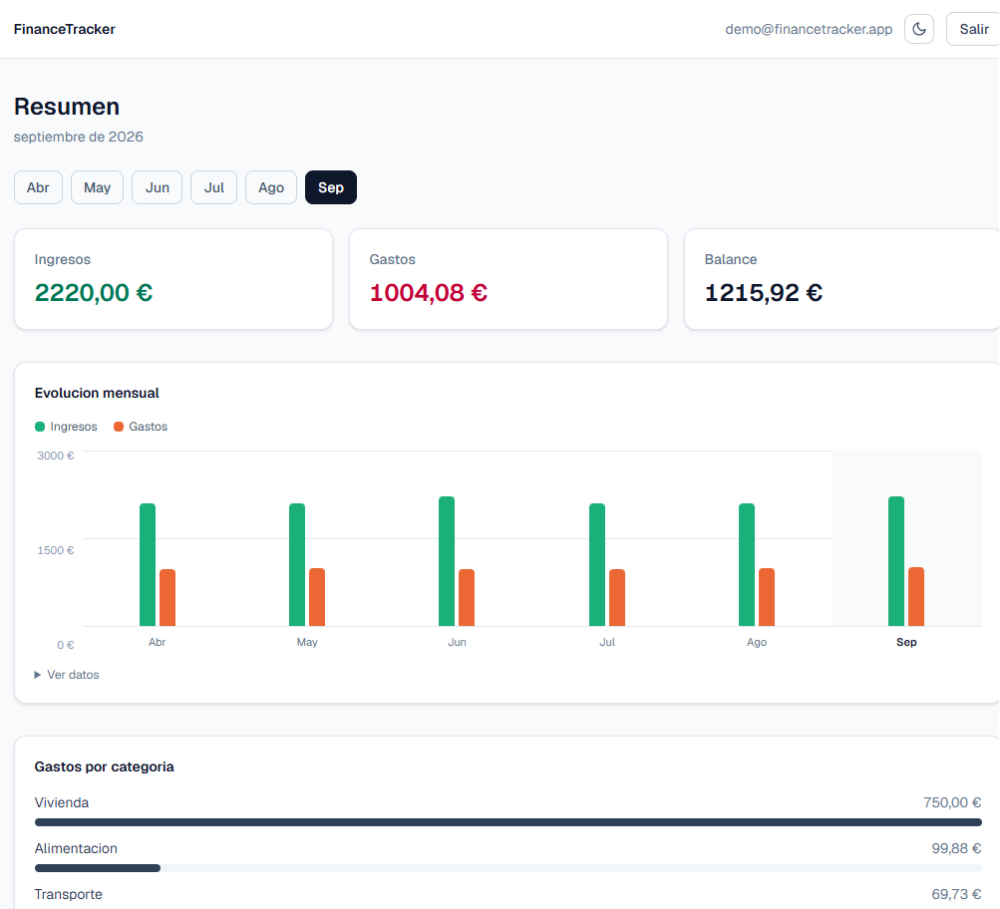
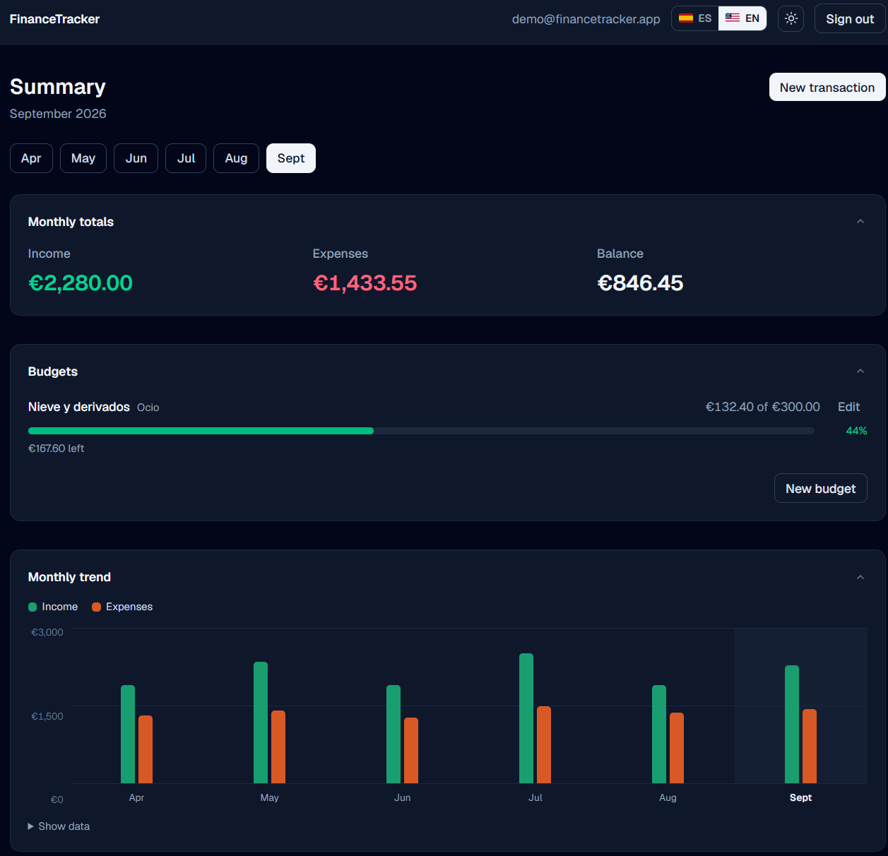
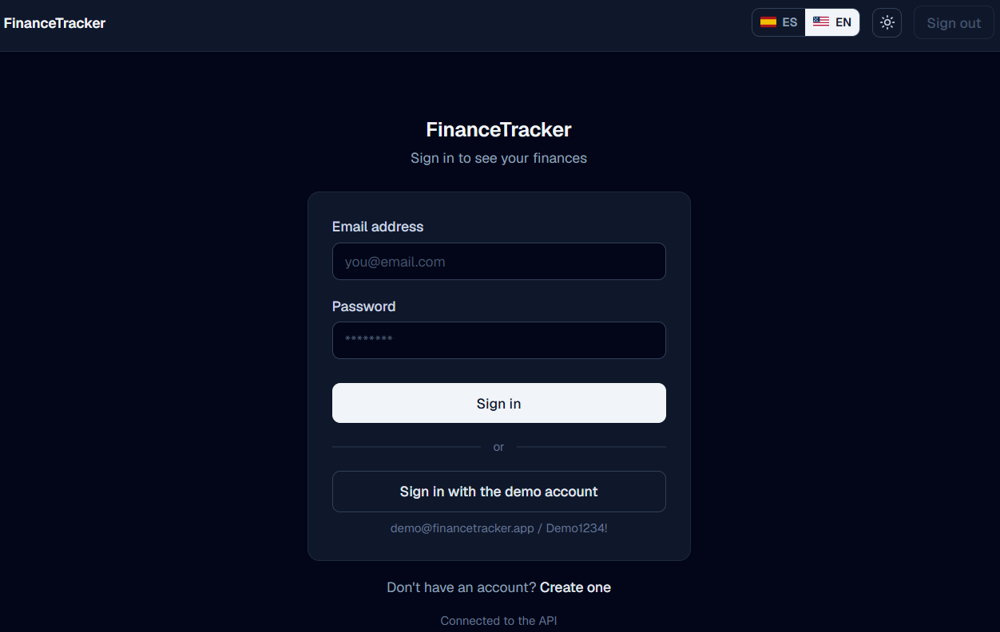

# 📊 FinanceTracker Web

[English](README.md) · **Español**

Interfaz web de [FinanceTracker](https://github.com/antonicr1986/FinanceTracker),
una API REST de finanzas personales construida con .NET 8.

**[Ver la aplicacion desplegada](https://financetracker-web-tau.vercel.app/login)** — entra con un clic
usando la cuenta de demostracion.

## 🚧 Estado

Funcionando de punta a punta contra la API real: registro y acceso con JWT,
datos desde Azure SQL y el panel calculado a partir de ellos.

Hay una **cuenta de demostracion publica**. El boton de la pantalla de acceso
entra con ella y carga datos sembrados por el backend, asi que se puede ver la
aplicacion sin registrarse.

Si no hay ninguna API configurada, la interfaz cae en datos de ejemplo en lugar
de romperse. Eso permite levantarla sin backend.

Pendiente: se pueden crear movimientos, pero todavia no editarlos ni borrarlos.

## ✨ Que hace

- **Registro y acceso** con JWT. Al registrarse se siembran categorias de
  partida, para poder anotar el primer movimiento sin configurar nada antes.
- **Panel mensual** con totales, evolucion a lo largo del ano, desglose por
  categoria y tabla de movimientos. Cada bloque se pliega y, plegado, resume su
  contenido en una linea.
- **Alta de movimientos** en un dialogo, con las categorias filtradas segun el
  tipo: la API rechaza un gasto con categoria de ingresos, asi que ni se ofrece.
- **Filtros** por concepto, tipo y categoria, resueltos en cliente sobre los
  datos ya cargados.
- **Espanol e ingles**, conmutables desde la cabecera. No solo los textos:
  tambien las fechas, los importes y los nombres de los meses siguen al idioma.
- **Tema claro y oscuro**, sin parpadeo al cargar.

## 🖼️ Vista previa

El dashboard, en claro y en oscuro:

Pantalla de acceso:

## 🧰 Stack

- **Next.js 16** con App Router
- **TypeScript**
- **Tailwind CSS 4**
- Desplegado en **Vercel**, con despliegue automatico en cada push a `main`

Sin librerias de graficos ni de componentes. El desglose por categorias esta
resuelto con CSS: cargar una dependencia entera para cinco barras
horizontales no compensa.

## ⚙️ Ejecutar en local

Requiere Node 20 o superior.

    npm install
    npm run dev

La aplicacion queda en http://localhost:3000.

Otros comandos:

    npm run build    # compilacion de produccion
    npm run lint     # analisis estatico con ESLint

## 📁 Estructura del proyecto

    src/
      app/          Rutas y paginas (App Router)
      components/   Cabecera, grafica, dialogos y piezas reutilizables
      lib/
        api/        Cliente HTTP, sesion y modo demostracion
        i18n/       Diccionarios, idioma activo y formatos por idioma
        derive.ts   Totales, series y agrupaciones a partir de los movimientos
        types.ts    Tipos que reflejan los DTOs de la API
        mock.ts     Datos de ejemplo para cuando no hay API configurada

## 🌍 Idiomas

Los textos viven en `src/lib/i18n/messages.ts`, en dos diccionarios planos. El
ingles se declara como `Record<MessageKey, string>`, de modo que **anadir una
clave sin traducirla rompe la compilacion**: es la forma barata de que las dos
versiones no se separen.

El idioma se guarda en el navegador y, si no hay nada guardado, se deduce del
propio navegador. Los importes y las fechas se formatean con `Intl` segun el
idioma activo, asi que en espanol se lee `1.234,56 €` y en ingles `€1,234.56`.

Los mensajes de error no viajan como frases: la API devuelve un codigo
(`email_already_exists`, `category_type_mismatch`...) y es el frontend quien
decide que se lee y en que idioma.

## 🔌 Conexion con la API

La URL de la API se resuelve en este orden: lo que el usuario haya guardado en
la pantalla de Configuracion y, si no hay nada, la variable de entorno
`NEXT_PUBLIC_API_URL`. Si tampoco esta, se usan los datos de ejemplo.

`NEXT_PUBLIC_*` se incrusta al compilar, no se lee al arrancar: cambiarla en
Vercel exige volver a desplegar para que surta efecto.

## 🔄 Automatizacion

- **CI** en cada push y pull request: instala dependencias, pasa el linter y
  compila para produccion, de modo que un error de tipos o de compilacion se
  detecta antes de llegar a produccion.
- **Escaneo de secretos** con gitleaks sobre el historial completo.
- **Rama `main` protegida** frente a *force push* y borrado.
- **Despliegue desde el pipeline**: la publicacion en produccion es un job final
  que solo arranca cuando el escaneo de secretos y la compilacion estan en
  verde. El despliegue automatico de Vercel esta desactivado, asi que nada llega
  a produccion sin pasar antes por los controles.

Meter el despliegue dentro del pipeline tiene un coste: las pull requests ya no
reciben URL de vista previa automatica de Vercel. Compensa. Antes, los dos
sistemas escuchaban el mismo push por separado y Vercel solia terminar primero,
de modo que un pipeline en rojo no impedia publicar: los controles opinaban
sobre codigo que ya estaba en produccion.

## 🗺️ Proximos pasos

- Editar y borrar movimientos
- Crear categorias desde el propio formulario de alta
- Presupuestos

## ✍️ Autor

Antonio Company - [GitHub](https://github.com/antonicr1986) ·
[LinkedIn](https://www.linkedin.com/in/antoniocompany/)
