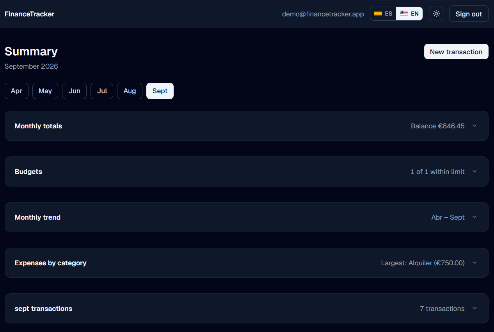
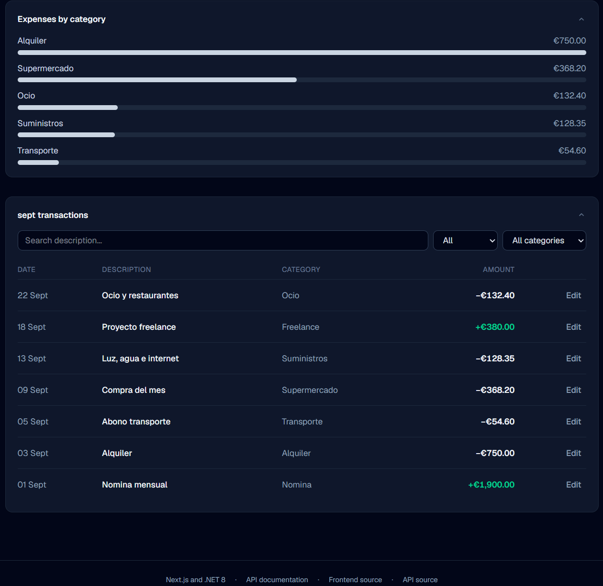
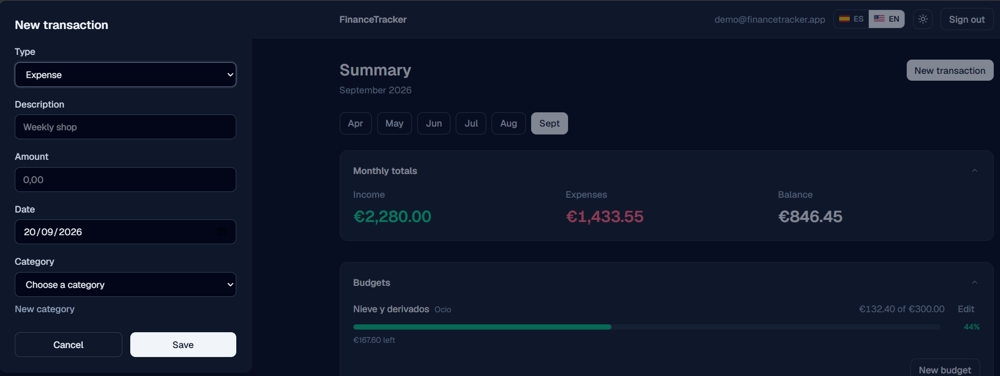

# 📊 FinanceTracker Web

**English** · [Español](README.es.md)

Web client for [FinanceTracker](https://github.com/antonicr1986/FinanceTracker),
a personal finance REST API built with .NET 8.

**One of three clients of that API**, alongside
[financetracker-android](https://github.com/antonicr1986/financetracker-android)
(Kotlin) and [financetracker-desktop](https://github.com/antonicr1986/financetracker-desktop)
(C# and WPF). The three reach the same endpoints, error codes and business rules
from different platforms, and share the same look, languages and demo account.

**[View the live application](https://financetracker-web-tau.vercel.app/login)** — one click gets you in with
the demo account.

## 🚧 Status

Running end to end against the real API: sign-up and JWT sign-in, data from
Azure SQL and a dashboard computed from it.

There is a **public demo account**. The button on the sign-in screen uses it and
loads data seeded by the backend, so the app can be explored without
registering.

When no API is configured the interface falls back to sample data rather than
breaking, which keeps it runnable without a backend.

## ✨ What it does

- **Sign-up and sign-in** with JWT. Registering seeds a starting set of
  categories, so the first transaction can be recorded without any setup.
- **Monthly dashboard** with totals, a trend across the year, a breakdown by
  category and a transaction table. Every block collapses and, once collapsed,
  sums itself up in a single line.
- **Creating, editing and deleting transactions** in a dialog, with categories
  filtered by type: the API rejects an expense filed under an income category,
  so it is never offered. Deleting asks for confirmation in the dialog itself.
- **Monthly budgets**, per category or across a whole type, with a progress bar
  and what is left. The spent amount, the remainder and the percentage are
  computed by the API, not derived in the browser.
- **Managing categories** from the dashboard: creating, renaming and deleting,
  grouped by type. The API refuses to delete a category that still has
  transactions, and that reason reaches the user in their own language.
- **Filters** by description, type and category, resolved on the client over the
  data already loaded.
- **Spanish and English**, switchable from the header. Not just the wording:
  dates, amounts and month names follow the language too.
- **Light and dark themes**, with no flash on load.

## 🖼️ Preview

The dashboard, in light and dark themes: the month's totals, the budgets with
how much of each is spent, and the trend across the year.

Every block collapses and, once collapsed, sums itself up in a single line: the
balance, how many budgets are still within their limit, the range of months, the
largest expense category and the number of transactions. The whole month at a
glance.

The breakdown by category and the transaction table, with filters by
description, type and category.

Recording a transaction, in a native dialog.

The sign-in screen, with one-click entry into the demo account.

## 🧰 Stack

- **Next.js 16** with the App Router
- **TypeScript**
- **Tailwind CSS 4**
- Deployed on **Vercel** from the pipeline, only once the checks pass (see
  [Automation](#-automation))

No charting or component libraries. The category breakdown is plain CSS:
pulling in a dependency for five horizontal bars is not worth the weight.

## ⚙️ Running locally

Requires Node 22 or later.

    npm install
    npm run dev

The app runs at http://localhost:3000.

Other commands:

    npm run build      # production build
    npm run lint       # static analysis with ESLint
    npm test           # unit and component tests
    npm run test:watch # the same tests, re-run on every change

## 📁 Project structure

    src/
      app/          Routes and pages (App Router)
      components/   Header, chart, dialogs and reusable pieces
      lib/
        api/        HTTP client, session and demo mode
        i18n/       Dictionaries, active language and per-language formats
        derive.ts   Totals, series and groupings built from the transactions
        types.ts    Types mirroring the API DTOs
        mock.ts     Sample data used when no API is configured
      test/         Test setup (jsdom, cleanup, <dialog> patch)

Tests sit next to the file they cover, as `*.test.ts` / `*.test.tsx`.

## 🌍 Languages

The copy lives in `src/lib/i18n/messages.ts`, in two flat dictionaries. The
English one is typed as `Record<MessageKey, string>`, so **adding a key without
translating it breaks the build** — the cheap way to keep both versions from
drifting apart.

The language is stored in the browser and, when nothing is stored, inferred from
the browser itself. Amounts and dates are formatted with `Intl` for the active
language, so Spanish reads `1.234,56 €` and English `€1,234.56`.

Error messages do not travel as sentences: the API returns a code
(`email_already_exists`, `category_type_mismatch`...) and the frontend decides
what is read, and in which language.

## 🔌 Connecting to the API

The API URL is resolved in this order: whatever the user saved on the Settings
screen and, failing that, the `NEXT_PUBLIC_API_URL` environment variable. If
neither is set, sample data is used.

`NEXT_PUBLIC_*` is inlined at build time rather than read at startup: changing
it on Vercel requires a redeploy to take effect.

## 🧪 Tests

Vitest and Testing Library, run with `npm test` and in the pipeline.

Two kinds. `derive.test.ts` covers the pure functions the dashboard is built
on: totals, grouping by month, the breakdown by category, and that month labels
follow the chosen language. `TransactionDialog.test.tsx` renders the dialog with
the API calls mocked and covers what actually broke during development: editing
loads the fields, changing the type clears the chosen category, deleting waits
for the confirmation, and pressing Enter in the new-category field creates the
category instead of submitting the transaction.

Two decisions worth stating. The assertions read their text from the Spanish
dictionary rather than hardcoding it, so they test behaviour and survive a
change of wording. And jsdom does not implement `<dialog>` reliably, so the
setup file supplies `showModal()` and `close()` — patching the environment
rather than reshaping the component to be testable, because native dialogs are
a deliberate choice here.

## 🔄 Automation

- **CI** on every push and pull request: installs dependencies, runs the
  linter, runs the tests and builds for production, so a type, test or build
  error is caught before it reaches production.
- **Secret scanning** with gitleaks across the full history.
- **Protected `main` branch** against force pushes and deletion.
- **Deployment from the pipeline**: production deploys run as a final job that
  only starts once secret scanning and the build are green. Vercel's own Git
  deployments are switched off, so nothing reaches production without clearing
  the checks first.

Wiring the deploy into the pipeline costs something: pull requests no longer
get automatic preview URLs from Vercel. That was worth trading. Before, the two
systems listened to the same push independently and Vercel usually finished
first, so a red pipeline did not stop a release - the checks were reporting on
code that was already live.

## 🗺️ Roadmap

- More tests around the dashboard filters
- Localised validation messages (the ones ASP.NET generates are still English)
- Starter categories seeded in the language chosen at sign-up

## ✍️ Author

Antonio Company - [GitHub](https://github.com/antonicr1986) ·
[LinkedIn](https://www.linkedin.com/in/antoniocompany/)
